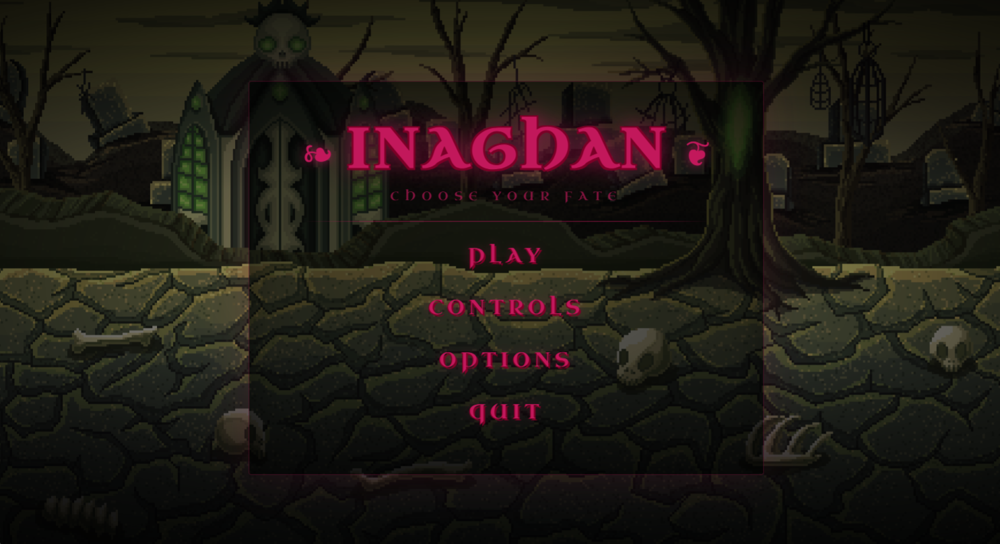
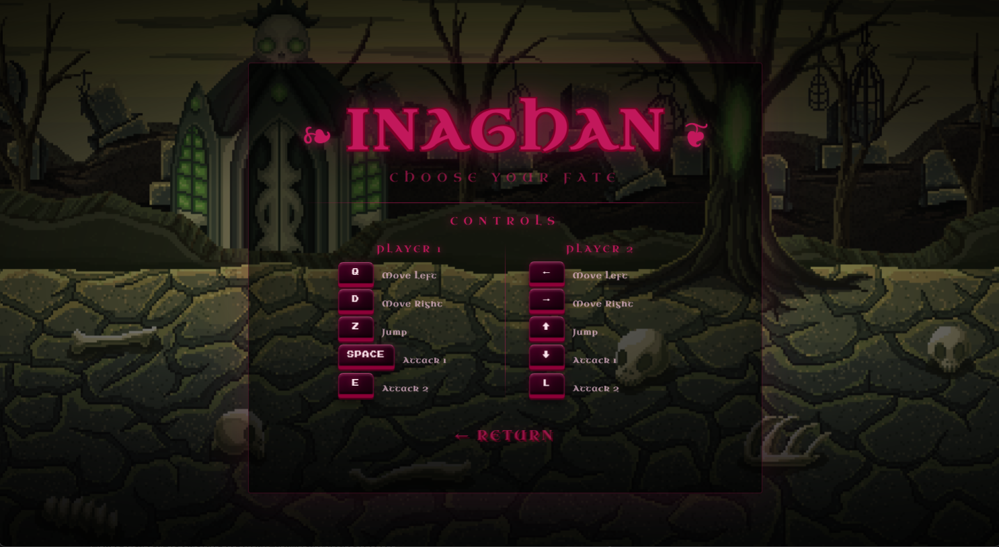
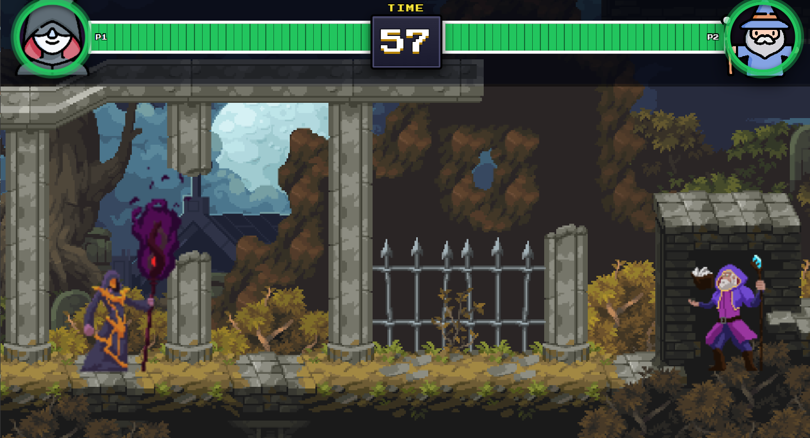

# INAGHAN — 2D Fighting Game

🎮 **[Play it live in your browser →](https://marouanbouderz.github.io/Inaghan_2d/)**


> A fast-paced two-player local fighting game built entirely with Vanilla JavaScript, HTML5 Canvas, and CSS.

---

## Screenshots

| Main Menu                           | Controls                                    |
|-------------------------------------|---------------------------------------------|
|   |        |



---

## Features

- **2-player local multiplayer** — two fighters on the same keyboard
- **Dynamic health-state HUD** — health bars and portrait borders change color (green → yellow → red) as health drops
- **Arcade-style timer** — pixel-art countdown with warning shake and critical glow
- **Animated main menu** — parallax background, animated key bindings screen, options panel with difficulty and volume
- **Dramatic PLAY transition** — GSAP-powered camera-rush and flash before the fight starts
- **3 · 2 · 1 · FIGHT! countdown** — with voice audio and blurred arena reveal
- **Victory & fight music** — dedicated MP3 tracks that switch on win/lose
- **Fullscreen scaling** — canvas scales to fill any screen size, no black bars
- **Sprite-sheet animation** — idle, run, jump, fall, attack × 2, take-hit, death for both fighters

---

## Tech Stack


---

## Controls

| Action     | Player 1 | Player 2   |
|------------|----------|------------|
| Move Left  | `Q`      | `←`        |
| Move Right | `D`      | `→`        |
| Jump       | `Z`      | `↑`        |
| Attack 1   | `SPACE`  | `↓`        |
| Attack 2   | `E`      | `L`        |

---

## How to Run Locally

No build step required — it's plain HTML/JS/CSS.

```bash
git clone https://github.com/marouanbouderz/Inaghan_2d.git
cd Inaghan_2d
```

Then open `index.html` in your browser directly, **or** use [Live Server](https://marketplace.visualstudio.com/items?itemName=ritwickdey.LiveServer) in VS Code for best results (avoids audio autoplay restrictions).

---

## Project Structure

```text
Inaghan_2d/
├── index.html                  # Entry point
├── assets/
│   ├── images/
│   │   ├── backgrounds/        # Arena and menu backgrounds
│   │   ├── characters/
│   │   │   ├── Shadow/         # P1 sprite sheets
│   │   │   └── Wizard/         # P2 sprite sheets
│   │   └── ui/                 # Portrait images
│   └── audio/
│       ├── fight-theme.mp3
│       ├── victory.mp3
│       ├── countdown.mp3
│       └── menu-music.ogg
└── src/
    ├── css/
    │   ├── style.css           # Game HUD styles
    │   └── menu.css            # Main menu styles
    └── js/
        ├── classes.js          # Sprite, Fighter, Platform classes
        ├── sounds.js           # SoundManager (Web Audio API + MP3)
        ├── utils.js            # Collision detection, timer, winner logic
        ├── menu.js             # Menu class
        └── main.js             # Game loop, input handling, game state
```

---

## Credits

- **Shadow character sprites** — [Chris Courses](https://www.youtube.com/@ChrisCourses) tutorial assets
- **Wizard character sprites** — [Aamatniekss](https://aamatniekss.itch.io/) on itch.io
- **Fight theme music** — "Decisive Battle 2 - The Calamity" (RPG Maker resource)
- **Victory music** — "Victory!" (RPG Maker resource)
- **Countdown voice** — freesound.org community (CC0)
- **Menu music** — "RPG Village Loop" (CC0)
- **GSAP** — [GreenSock Animation Platform](https://gsap.com/) (free tier)

---

## License

MIT © 2025 Marouan Bouderz — see [LICENSE](LICENSE) for details.

---

*Built by **Marouan Bouderz**, Computer Engineering student at ENSAH Al Hoceima.*
*[LinkedIn](https://www.linkedin.com/in/marouan-bouderz-abb91a339) · [GitHub](https://github.com/marouanbouderz)*
